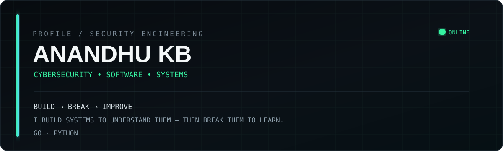

 

---

## About

I build software to understand systems — and practice security in controlled environments to understand how they fail.

My current focus sits between **cybersecurity, systems-oriented software engineering, and practical security tooling**.

> **Build → Break → Understand → Improve**

---

## Featured Work

<table>
<tr>
<td width="50%" valign="top">

### 🛡️ Sentinel-OS

A local-first developer and system monitoring platform built with **Go + Wails**.

- System & resource telemetry
- HTTP / TCP uptime monitoring
- Productivity tracking
- Local snapshot engine
- Structured logging
- Gemini / Ollama / NVIDIA AI integration

**Go · Wails · SQLite · JavaScript**

 

<a href="https://github.com/anandhu-kb/Sentinel-OS">→ View project</a>

</td>
<td width="50%" valign="top">

### ⚔️ CTF-Walkthroughs

Hands-on security write-ups from **Hack The Box** and **TryHackMe** labs.

- Reconnaissance
- Service enumeration
- Web security
- Initial access
- Credential discovery
- Linux privilege escalation

**HTB · THM · Linux · Web Security**

 

<a href="https://github.com/anandhu-kb/CTF-Walkthroughs">→ View write-ups</a>

</td>
</tr>
<tr>
<td colspan="2" valign="top">

### ⚡ Gemini Counter

A Chrome extension built with JavaScript for the Gemini web interface, focused on useful conversation visibility and developer-oriented utilities.

**JavaScript · Chrome Extensions · Browser APIs**

<a href="https://github.com/anandhu-kb/Gemini_Counter.js">→ View project</a>

</td>
</tr>
</table>

---

## Security Focus

| WEB SECURITY | NETWORKING | LINUX | SECURITY TOOLING |
|:---:|:---:|:---:|:---:|
| Web enumeration | Service discovery | Enumeration | Automation |
| Application testing | HTTP / TCP | Privilege escalation | Developer tooling |
| Authentication | Network analysis | Post-exploitation | Security research |

---

## Stack

---

## Current Direction

<table>
<tr>
<td>

**01 — Build**

Developing larger software systems with an emphasis on architecture, concurrency, persistence, and maintainability.

</td>
<td>

**02 — Break**

Using authorized CTF and lab environments to practice reconnaissance, exploitation, and privilege escalation.

</td>
<td>

**03 — Research**

Exploring security tooling, vulnerable applications, system internals, and practical defensive/offensive techniques.

</td>
</tr>
</table>

---

## GitHub Activity

---

### `INTERESTED IN SECURITY? LET'S BUILD SOMETHING WORTH BREAKING.`

<a href="https://anandhu-security-portfolio.vercel.app/">Portfolio</a>
&nbsp;·&nbsp;
<a href="https://github.com/anandhu-kb">GitHub</a>
&nbsp;·&nbsp;
<a href="https://github.com/anandhu-kb/CTF-Walkthroughs">CTF Write-ups</a>

